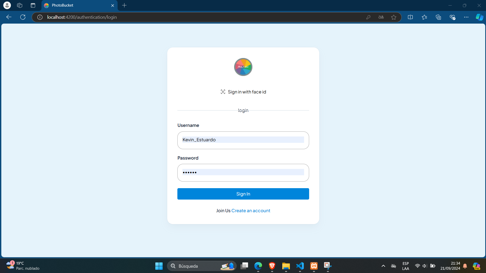
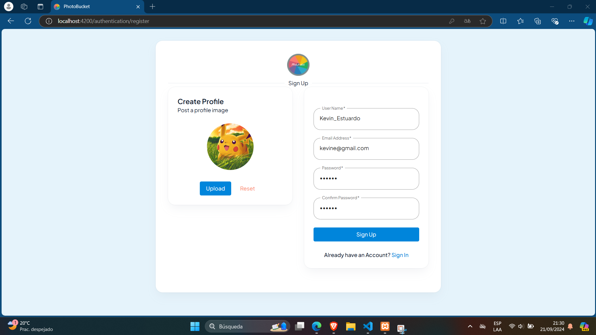
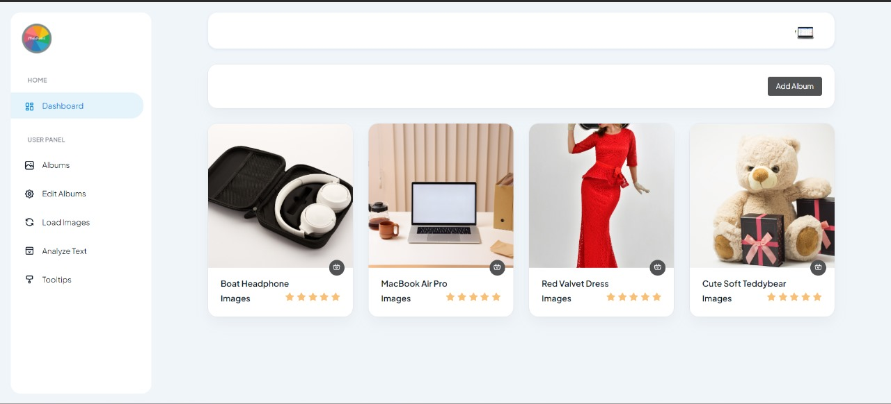
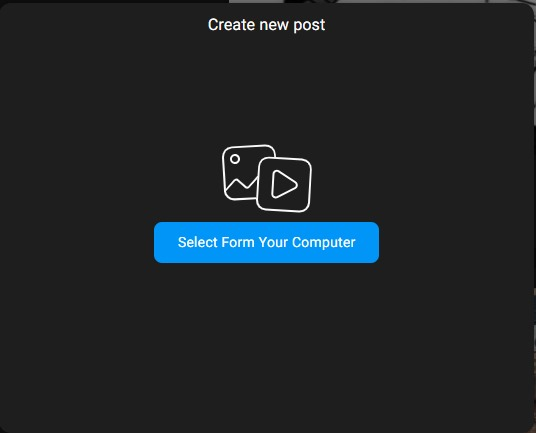
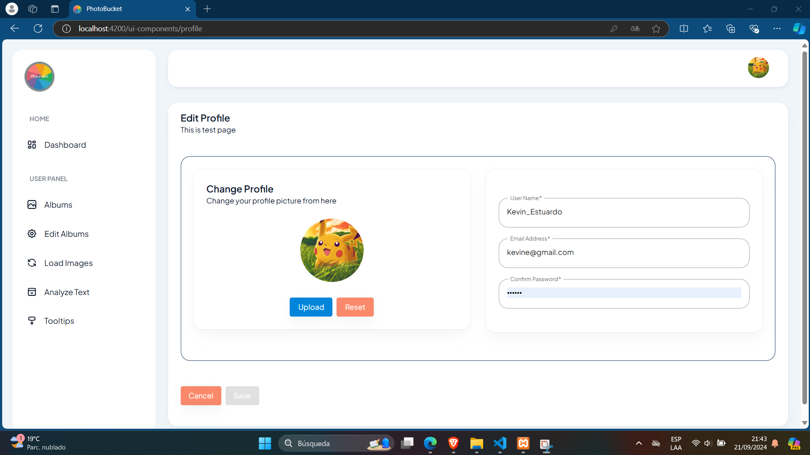
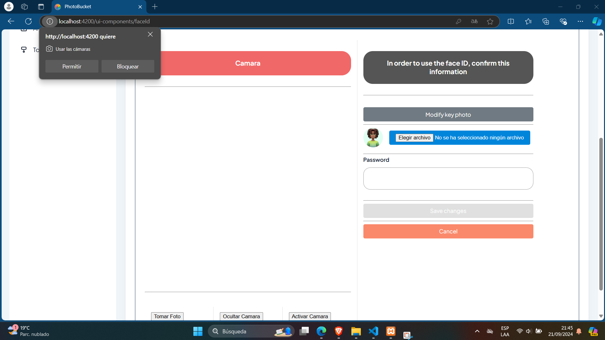
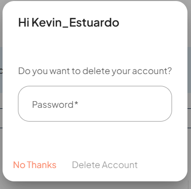

## Bienvenido a:

# Manual de Usuario

## ÍNDICE#️⃣:

1. [Objetivos](#objetivos)
2. [Explicación y Descripción de la aplicación](#explicación-y-descripción-de-la-aplicación)
3. [Cómo utilizar la aplicación](#cómo-utilizar-la-aplicación)
   - [Usuario Subscriptor](#usuario-subscriptor)
     - [Ingresar a la plataforma](#1-ingresar-a-la-plataforma)
     - [Registro](#2-registro)
     - [Home](#3-home)

## Objetivos:

### General:

Desarrollar e implementar una solución web en la nube que permita el almacenamiento, gestión y análisis de fotos mediante los servicios de Amazon Web Services (AWS), proporcionando una experiencia interactiva y funcional para los usuarios de Photobucket.

### Objetivos Específicos

- Crear e implementar una arquitectura en la nube que integre varios servicios de AWS, como Amazon EC2, S3 y RDS, para alojar el back-end, front-end y el almacenamiento de imágenes.

- Desarrollar funcionalidades avanzadas como el reconocimiento facial, extracción de texto y traducción de contenido mediante Amazon Rekognition y Amazon Translate​.

## Explicación y Descripción de la aplicación

Se presenta la plataforma denominada "Photobucket", una aplicación en la nube - accesible desde cualquier navegador, el usuario suscriptor de Photobucket podrá disfrutar de funciones tales como:
Registrarse, Iniciar sesión, configuración de reconocimiento facial, eliminación de la cuenta, ver álbumes, vista detallada de la imagen, editar Album, subir imagen,

## Cómo utilizar la aplicación

### _Usuario Subscriptor_

#### 1. Ingresar a la plataforma/crear usuario

Si posee cuenta, podrá ingresar con su correo electrónico y contraseña, de lo contrario, deberá registrarse.

#### 2. Registro

Para poder registrarse, en la pantalla de inicio deberá de hacer click en la sección de **Regístrate aquí**. Una vez hecho esto, se le presentará la siguiente pantalla:
 

#### 3. Añadir Albúm

Una vez hayas iniciado sesión entraras en el Dashboard para añadir un album:

#### 4. Load Images

Podrás cargar las imagenes que tú quieras:

#### 5. Analyze Text

Podrás analizar todas la imagenes previamente cargadas:

#### 6. User Settings

Podrás editar la información del usuario:

#### 7. Face ID

Puedes habilitar el inicio de sesión por medio del reconocimiento facial:

#### 8. Delet User

### Puedes eliminar tu cuenta!

